# console

Administration console for abcdesktop.  
console communicates with pyos which is the abcdesktop control plane, API services.

## Prerequisites

You need to have at least a 5.0 abcdesktop session running.  
To access console, open your browser and connect to `http://[your-abcdesktop-address]:30443/console`

## Table of Contents

1. [Desktops management](#desktops-management)
    - [Toolbar actions](#toolbar-actions-desktop)
    - [Gathering more informations](#gathering-more-informations)
    - [Deleting desktop](#deleting-desktop)
2. [Applications management](#applications-management)
    - [Toolbar actions](#toolbar-actions-application)
    - [Add application](#add-application)
        - [Add from application store](#add-from-application-store)
        - [Add from JSON file](#add-from-json-file)
    - [Delete application](#delete-application)
    - [Gathering application informations](#gathering-application-informations)
3. [Ban Users](#ban-users)
    - [Toolbar actions](#toolbar-actions-ban)
    - [From IP](#from-ip)
    - [From Login](#from-login)
4. [Config editor](#config-editor)
    - [Overview](#overview)
    - [Toolbar actions](#toolbar-actions-config)
    - [General](#general)
    - [Controllers](#controllers)
    - [Auth](#auth)
    - [Execute Classes](#execute-classes)
    - [Desktop](#desktop)
    - [Pod](#pod)
    - [Frontend](#frontend)
    - [Logging](#logging)

## Desktops management

Once a desktop has been created on your abcdesktop session, you can find it on the desktops page of console.
  

### Toolbar actions

| Icon | Action | Description |
|------|--------|-------------|
| 🗑️ Trash | **Delete selected** | Deletes all the desktops currently selected via their checkbox. |
| 🔄 Refresh | **Refresh** | Reloads the desktops table from the API. |

### Gathering more informations

If you want more informations about the desktop, such as real time resources usage, applications containers currently running or the different labels, you can click on the desktop name.

### Deleting desktop

To delete a single desktop, click on the red trash icon at the end of its line. To delete several desktops at once, select them and use the **Delete selected** button described above.

## Applications management

console offers the possibility to manage the apps through the applications page.

### Toolbar actions

| Icon | Action | Description |
|------|--------|-------------|
| ➕ Plus | **Add** | Opens the application store modal, from which you can also switch to adding an app from a JSON file. |
| 🗑️ Trash | **Delete selected** | Deletes all the applications currently selected via their checkbox. |
| 🔄 Refresh | **Refresh** | Reloads the applications table from the API. |

### Add application

On the application page, click on the blue + button. You will have two possibilities :

- Add from the applications store
- Add from JSON file

#### Add from application store

Through this modal window, you can add application by exploring the application store, click on the app you want to add, its background color should change to indicate that the app has been selected, and finally click on the Add button.  
Also, as there are quite a few applications, you can use the search bar on the to right corner to help you find the app you are searching for.

 

Note that clicking on the JSON button will open a modal that allows you to add applications from JSON file as shown below.

#### Add from JSON file

Through this modal window, you can add applications by uploading a JSON file or by copy-pasting directly the JSON raw content in the text area.

 

Note that the github button will send you directly to the abcdesktop github applications page.

### Delete application

To delete applications one by one you can click on the red trash at the end of the line on the row where the app you want to delete is located.  
Or if you want to delete several applications at the same time you can select them and click on the red trash button above the table to delete all the selected applications.

### Gathering application informations

If you want to get more informations about an application, just click on the name of the app to display the whole json file of the app.

## Ban users

As an admin, you will probably face the necessity to ban users for various reasons. You can both ban from ip and login

### Toolbar actions

Both the "From IP" and "From Login" pages share the same toolbar:

| Icon | Action | Description |
|------|--------|-------------|
| ➕ Plus | **Add ban** | Opens a modal to ban a new IP address or login, depending on the page. |
| 🗑️ Trash | **Delete selected** | Unbans all the entries currently selected via their checkbox. |
| 🔄 Refresh | **Refresh** | Reloads the ban table from the API. |

### From IP

To ban a user, you have to click on the blue + button and enter the IP you want to ban. IPs are IPV4 format X.X.X.X

### From login

To ban a user, you have to click on the blue + button and enter the login you want to ban.

## Config editor

The config page lets you view and edit the abcdesktop `od.config` directly from console, without having to manually edit the ConfigMap or restart pods by hand.

### Overview

The config page is organized as a set of tabs, one per configuration domain (General, Controllers, Auth, Execute Classes, Desktop, Pod, Frontend, Logging). Each tab exposes the relevant fields of `od.config` through dedicated forms instead of raw JSON.

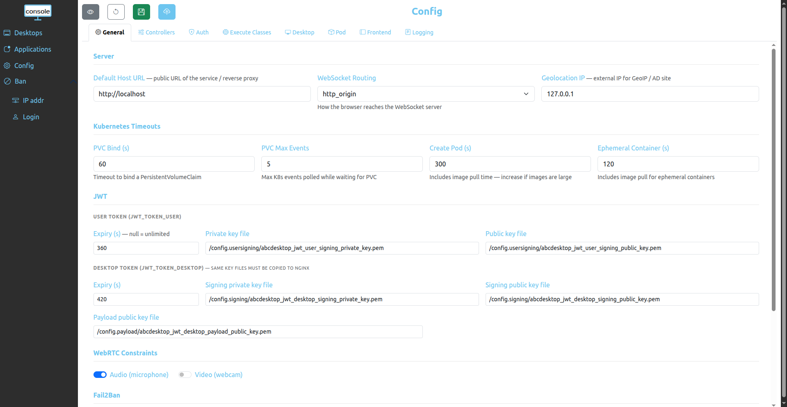

While your changes have not been saved yet, the page title displays a dot (`Config ●`) to indicate unsaved changes.

### Toolbar actions

Four buttons are available at the top of the page:

| Icon | Action | Description |
|------|--------|-------------|
| 👁️ Eye | **Preview** | Opens a modal showing the full config as JSON, including your unsaved local edits. |
| ↺ Undo | **Discard changes** | Reverts all local edits back to the last saved config. |
| 💾 Save | **Save** | Sends the edited config to the API (`POST /API/manager/configure`) and apply it only for the current pyos instance. |
| ☁️ Upload | **Apply to cluster** | Updates the Kubernetes ConfigMap with the saved config, then triggers a rollout restart of pyos so the new config is taken into account. |

#### Preview modal

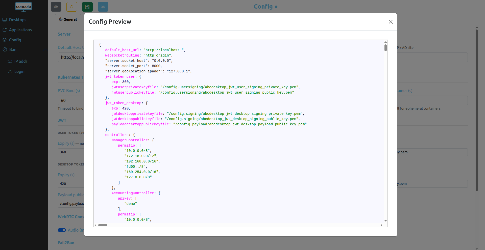

### General

Server settings (host URL, websocket routing, socket host/port, geolocation), Kubernetes timeouts (PVC bind, pod creation, ephemeral container), JWT token settings (user and desktop tokens), and OAuth library flags.

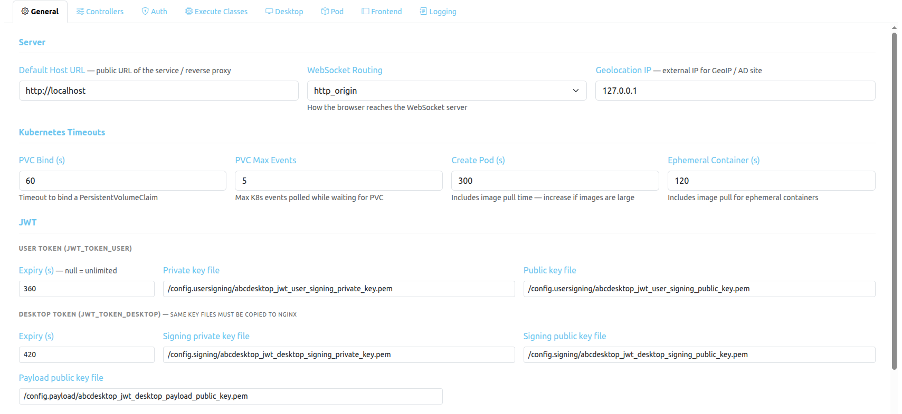
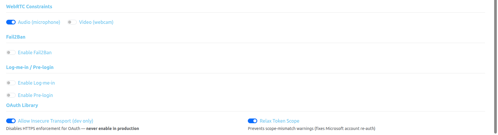

### Controllers

Manage the API controllers (`ManagerController`, `DesktopController`, `ComposerController`, `StoreController`, and any additional controller such as `AccountingController`): API keys and permitted IP ranges (CIDR) per controller.

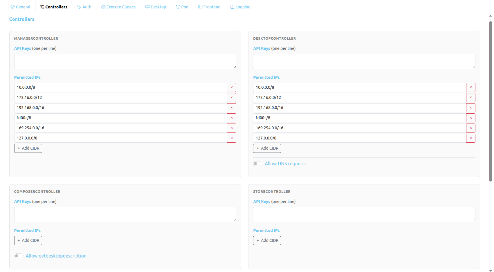
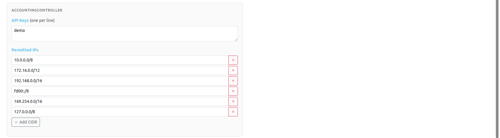

### Auth

Configure the three authentication managers:

- **Implicit** — the anonymous provider (display name, caption, colors, icon).
- **Explicit (LDAP / AD)** — LDAP/Active Directory servers, base DN, service account, and domain settings.
- **External (OAuth 2.0)** — third-party identity providers (Google, GitHub, Orange, …), with client credentials, scopes, and endpoint URLs.

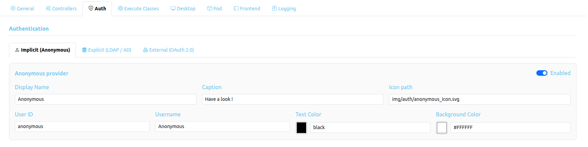
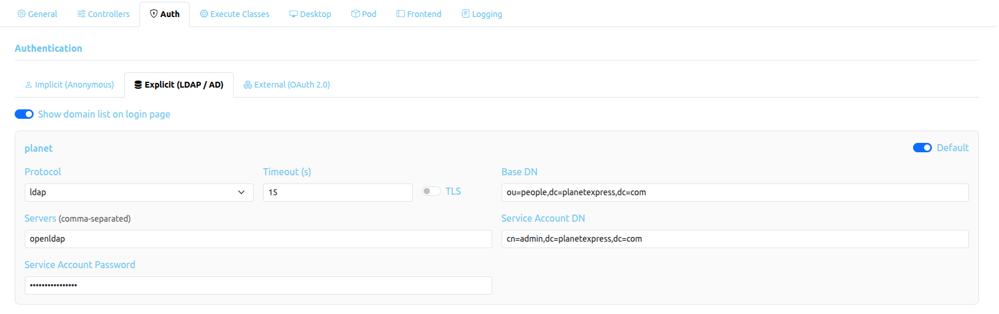
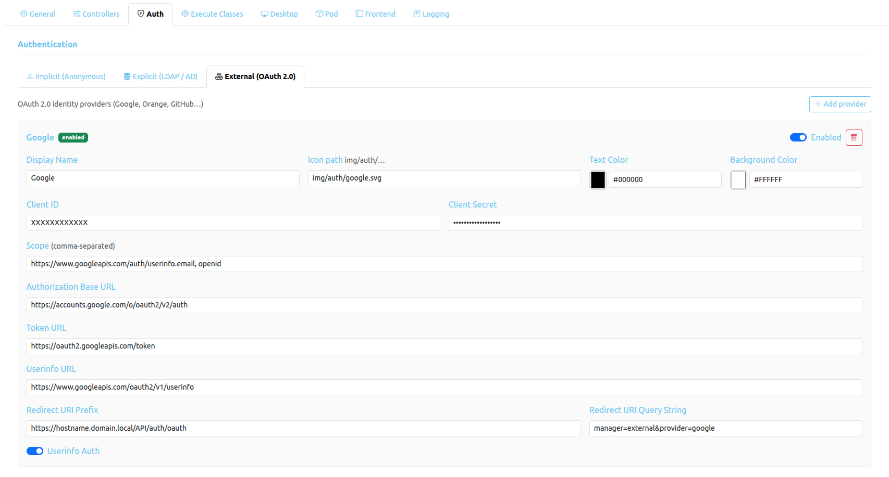

### Execute Classes

Define the resource quota classes available to desktops (e.g. `default`, `bronze`, `silver`, `gold`, `platinum`): CPU/memory requests and limits, node selectors, runtime class, and GPU allocation.

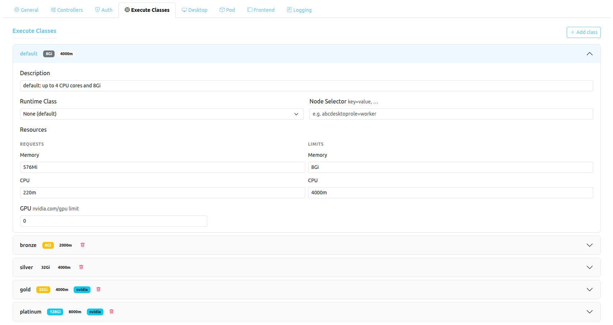

### Desktop

Desktop-wide settings: user account (username, uid/gid, home directory), appearance (theme, zoom, background colors), home directory persistence (hostPath or PersistentVolumeClaim, with a dedicated PV/PVC editor), environment variables, and node selector.

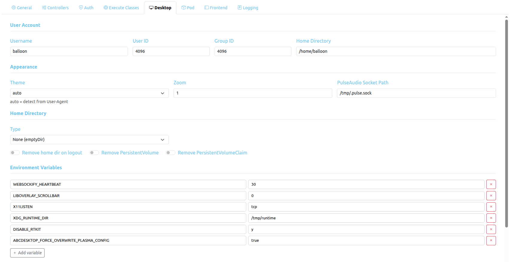
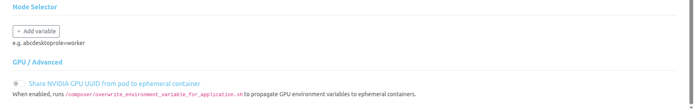

### Pod

Configure the containers that make up a desktop pod (graphical, spawner, sound, filer, printer, webshell, init, …): enable/disable, image and pull policy, mounted volumes, and security context.

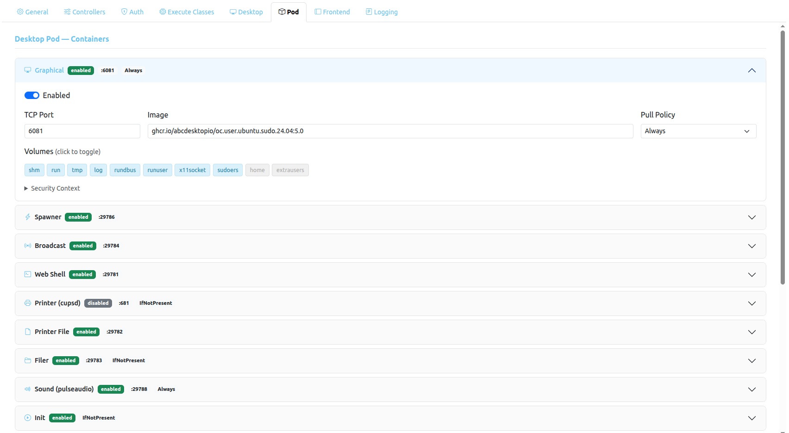
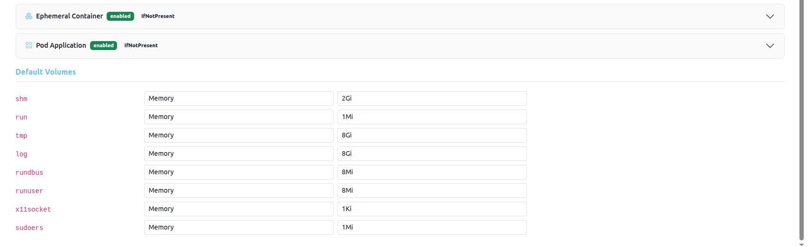

### Frontend

Front-end/UI options: main menu toggles, image pull notifications, background color palette, tips, and welcome info (scheduled maintenance messages or injected scripts shown on the login/desktop front).

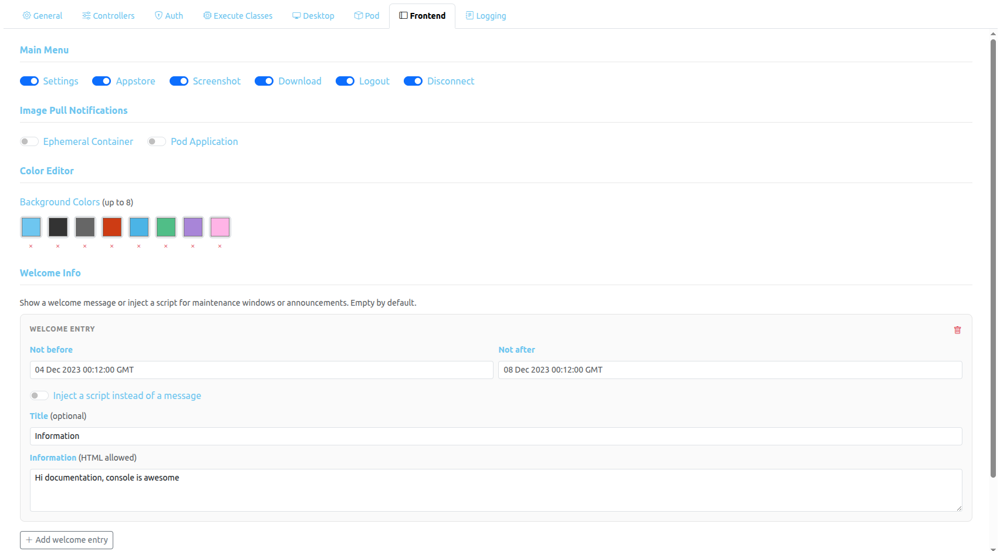
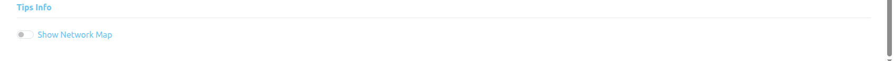

### Logging

Configure the Python logging stack used by pyos: global settings (version, disable existing loggers), formatters, filters, handlers (stdout, stderr, rotating file handlers), and per-module logger levels — including the root logger.

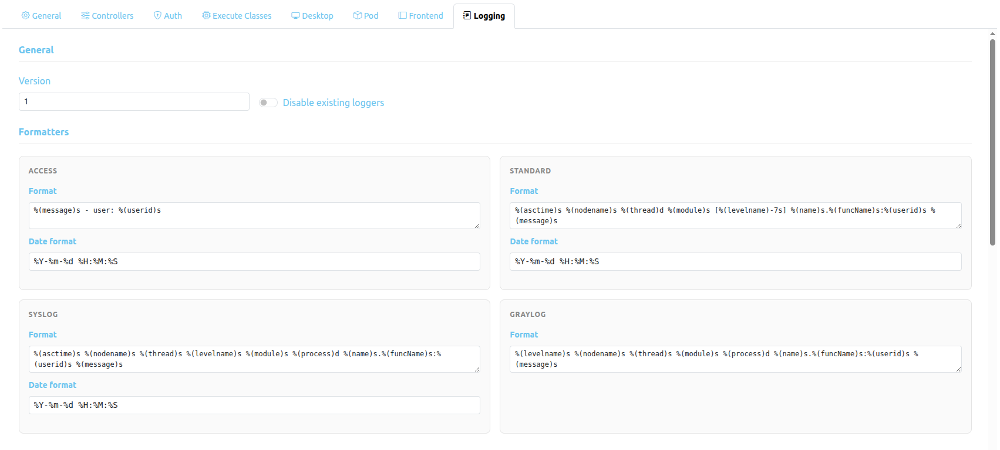
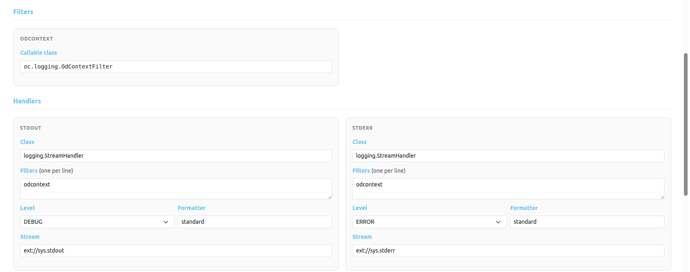
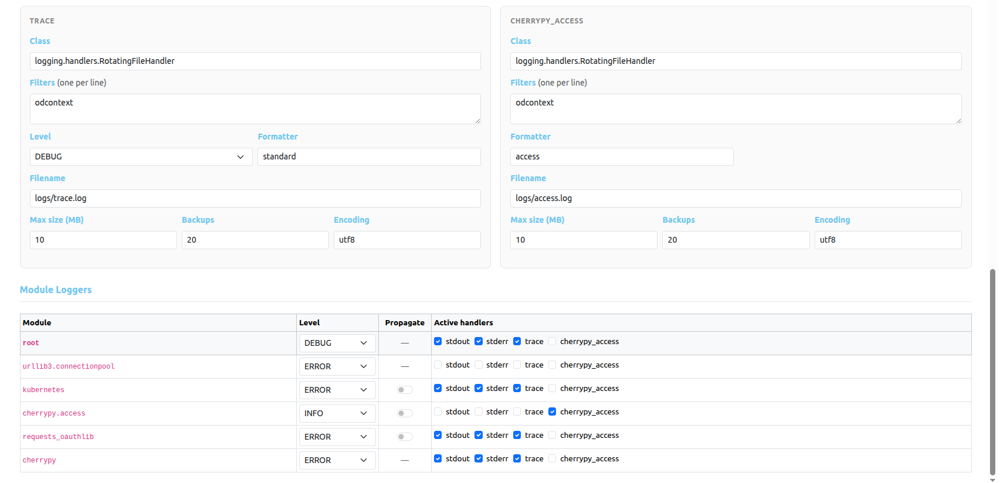