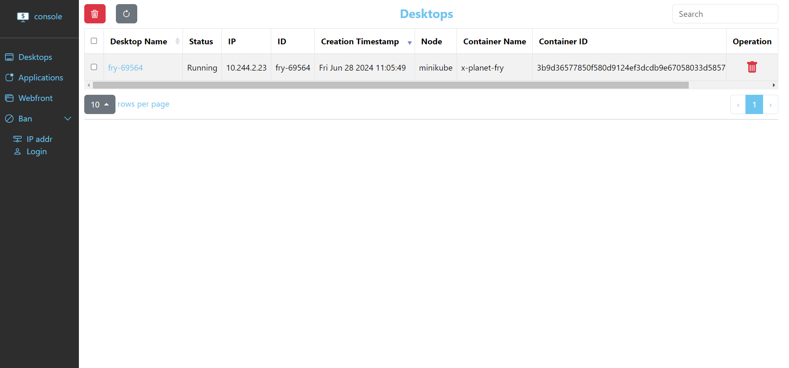
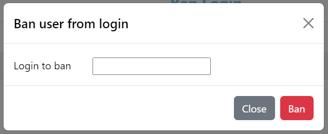

# console

Administation console for abcdesktop.  
console communicates with pyos which is the abcdesktop control plane, API services.

## Prerequisites

You need to have a 3.3 abcdesktop session running.  
To access console, open your browser and connect to `http://[your-abcdesktop-address]:30443/console`

## Table of Contents

1. [Desktops management](#desktops-management)
2. [Applications management](#applications-management)
3. [Webfront management](#webfront-management)
4. [Ban Users](#ban-users)
    - [From IP](#from-ip)
    - [From Login](#from-login)

## Desktops management

Once a desktop has been created on your abcdesktop session, you can find it on the desktops page of console.
  

### Gathering more informations

If you want more informations about the desktop, such as the applications containers currently running or the diffrents labels, you can click on the desktop name.

### Deleting desktop

To delete a desktop you just have to click on the red trash at the end of the line.

## Applications management

console offers the possibility to manage the apps through the applications page.

### Add application

Please find the applications in the following repository : [https://github.com/abcdesktopio/images/](https://github.com/abcdesktopio/images/)

On the application page, click on the blue + button. You will have two possibilities :

- Add from a json file on your computer
- Add from copy-paste the raw json of the app

 

### Delete application

To delete applications one by one you can click on the red trash at the end oh the line on the row where the app you want to delete is located.  
Or if you want to delete several applications at the same time you can select them and click on the red trash button above the table to delete all the selected applications.

### Gathering more informations

If you want to get more informations about an application, just click on the name of the app to display the whole json file of the app.

## Webfront management

On the webfront page, you can edit users docks but only when they have made an alteration compared to the default profile.

Then click on the user's name you want to modify the dock

### Add application to dock 

To add an application to the user's dock, you first have to click on the blue + button and select among the installed applications that are not currently on the dock.

### Delete application from dock

To delete an application from the dock, you just have to click on the red trash at the end of the line on the row of the app you want to remove.

## Ban users

As an admin, you will probably face the necessity to ban users for various reasons. You can both ban from ip and login

### From IP

To ban a user, you have to click on the blue + button and enter the IP you want to ban. IPs are IPV4 format X.X.X.X

### From login

To ban a user, you have to click on the blue + button and enter the login you want to ban.

